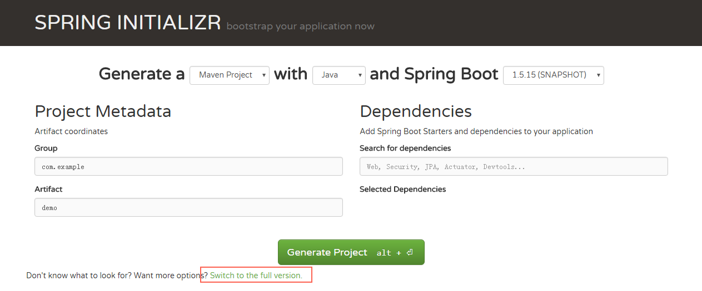

<html>
<head>
  <title>Evernote Export</title>
  <basefont face="微软雅黑" size="2" />
  <meta http-equiv="Content-Type" content="text/html;charset=utf-8" />
  <meta name="exporter-version" content="Evernote Windows/305741 (zh-CN, DDL); Windows/6.1.7601 Service Pack 1 (Win64);"/>
  
</head>
<body>
<a name="671"/>

Springboot之前出现的问题

Spring框架需要进行大量的配置

项目的依赖管理冲突

为什么是SpringBoot

    Spring Boot本身并不提供Spring框架的核心特性以及扩展功能，只是用于快速、敏捷地开发新一代基于Spring框架的应用程序。也就是说，它并不是用来替代Spring的解决方案，而是和Spring框架紧密结合用于提升Spring开发者体验的工具。

 

 

Spring Boot继承了Spring的优点，并新增了一些新功能和特性

（0）从字面理解，Boot是引导的意思，因此SpringBoot帮助开发者快速搭建Spring框架，Spring 项目引导页面可以在几秒构建一个项目

（1）Spring Boot 内置了多种种强大的测试框架，只需要在项目中引入spring-boot-start-test依赖包

（2）Spring Boot 的自动配置让配置变简单；

（3）SpringBoot的起步依赖让依赖管理更加简单；

（4）Spring Boot Actuator对应用系统监控的集成功能；

 

（5）现在spring boot和spring cloud是现在java开发框架的主流了

 

 

     Spring Boot提供了一种新的编程范式，能在最小的阻力下开发Spring应用程序。有了它，你可以更加敏捷地开发Spring应用程序，专注于应用程序的功能，不用在Spring的配置上多花功夫，甚至完全不用配置。实际上，Spring Boot的一项重要工作就是让Spring不再成为你成功路上的绊脚石。    ——《SpringBoot实战》

 

springboot如何做到

 

构建springboot项目

访问<a href="http://start.spring.io/" style="font-size: 11pt;">http://start.spring.io/</a>

选择构建工具Maven Project、Spring Boot版本以及一些工程基本信息

下载压缩包以后直接导入到ide中就可以了，大概就是这个样子

 

 

这个是我大致画的一些spring的东西，先从代码结构说吧

<a href="http://naotu.baidu.com/file/e8972e3eff7fc8a1a54dd7c2d6d946d5" style="font-size: 11pt;">http://naotu.baidu.com/file/e8972e3eff7fc8a1a54dd7c2d6d946d5</a>

 

这是一般的主程序入口，当然在我们的项目中，因为并没有使用springboot内置的tomcat，所以启动方式有所不同

 

@SpringBootApplication

public class DemoApplication {

       public static void main(String[] args) {

              SpringApplication.run(DemoApplication.class, args);

       }

}

 

不适用内置tomcat的情况，原理没有区别

@SpringBootApplication

@EnableAutoConfiguration(exclude = { DataSourceAutoConfiguration.class, RedisAutoConfiguration.class,

              DataSourceTransactionManagerAutoConfiguration.class, })

@ComponentScan({ &quot;com.fanli.*&quot; })

public class Application extends SpringBootServletInitializer {

       @Override

       protected SpringApplicationBuilder configure(SpringApplicationBuilder application) {

              return application.sources(Application.class);

       }

}

 

@SpringBootApplication

<a href="http://naotu.baidu.com/file/22b4f6b67337826229f8c66e503315e9?token=a382b478d700da4b" style="color: rgb(51, 51, 51); font-family: Consolas; text-decoration: underline;">http://naotu.baidu.com/file/22b4f6b67337826229f8c66e503315e9?token=a382b478d700da4b</a>

 

/**

 * Indicates a {@link Configuration configuration} class that declares one or more

 * {@link Bean @Bean} methods and also triggers {@link EnableAutoConfiguration

 * auto-configuration} and {@link ComponentScan component scanning}. This is a convenience

 * annotation that is equivalent to declaring {@code @Configuration},

 * {@code @EnableAutoConfiguration} and {@code @ComponentScan}.

 *

 * @author Phillip Webb

 * @author Stephane Nicoll

 * @since 1.2.0

 */

@Target(ElementType.TYPE)

@Retention(RetentionPolicy.RUNTIME)

@Documented

@Inherited

@SpringBootConfiguration

@EnableAutoConfiguration

@ComponentScan(excludeFilters = {

              @Filter(type = FilterType.CUSTOM, classes = TypeExcludeFilter.class),

              @Filter(type = FilterType.CUSTOM, classes = AutoConfigurationExcludeFilter.class) })

public @interface SpringBootApplication {

     ......

}

 

@SpringBootConfiguration，@EnableAutoConfiguration以及@ComponentScan的组合

 

/**

 * Indicates that a class provides Spring Boot application

 * {@link Configuration @Configuration}. Can be used as an alternative to the Spring's

 * standard {@code @Configuration} annotation so that configuration can be found

 * automatically (for example in tests).

 * &lt;p&gt;

 * Application should only ever include &lt;em&gt;one&lt;/em&gt; {@code @SpringBootConfiguration} and

 * most idiomatic Spring Boot applications will inherit it from

 * {@code @SpringBootApplication}.

 *

 * @author Phillip Webb

 * @since 1.4.0

 */

@Target(ElementType.TYPE)

@Retention(RetentionPolicy.RUNTIME)

@Documented

@Configuration

public @interface SpringBootConfiguration {

}

@SpringBootConfiguration而@Configuration有相同的作用，配备了该注解的类就能够以JavaConfig的方式完成一些配置，可以不再使用XML配置

 

 

@ComponentScan注解完成的是自动扫描的功能，相当于Spring XML配置文件中的

&lt;context:component-scan&gt;,

如果不设置的话默认扫描@ComponentScan注解所在类的同级类和同级目录下的所有类，所以对于一个Spring Boot项目，一般会把入口类放在顶层目录中，这样就能够保证源码目录下的所有类都能够被扫描到。如果需要设置的话如下代码

 

@SpringBootApplication

@EnableAutoConfiguration(exclude = { DataSourceAutoConfiguration.class, RedisAutoConfiguration.class,

              DataSourceTransactionManagerAutoConfiguration.class, })

@ComponentScan({ &quot;com.fanli.*&quot; })

public class Application extends SpringBootServletInitializer {。。。。。。

 

 

 

@EnableAutoConfiguration（核心）

　这个注释告诉SpringBoot“猜”你将如何想配置Spring,基于你已经添加的依赖项，如果我们使用了spring-boot-starter-web并且已经添加Tomcat和Spring MVC,@EnableAutoConfiguration自动将假设您正在开发一个web应用程序并添加相应的Spring设置。

 

    Spring Boot的自动配置是一个运行时（更准确地说，是应用程序启动时）的过程，考虑了众多因素，才决定Spring配置应该用哪个，不该用哪个。举个例子。Spring的JdbcTemplate是不是在Classpath里？如果是，并且有DataSource的Bean，则自动配置一个JdbcTemplate的Bean。每当应用程序启动的时候，Spring Boot的自动配置都要做将近200个这样的决定，涵盖安全、集成、持久化、Web开发等诸多方面。所有这些自动配置就是为了尽量不让你自己写配置。

 

    在向应用程序加入Spring Boot时，有个名为spring-boot-autoconfigure的JAR文件，其中包含了很多自动配置类（自动配置类就是普通的Spring @Configuration类，通过SpringFactoriesLoader机制完成加载，实现上通常使用@Conditional(比如@ConditionalOnClass或者@ConditionalOnMissingBean））。

每个配置类都在应用程序的Classpath里，都有机会为应用程序的配置添砖加瓦。这些配置类里有用于AOP的配置，有用于Spring Data JPA的配置，有用于Spiring MVC的配置，还有很多其他东西的配置，你可以自己选择是否在Spring应用程序里使用它们。

 

@SuppressWarnings(&quot;deprecation&quot;) 

@Target(ElementType.TYPE) 

@Retention(RetentionPolicy.RUNTIME)

@Documented 

@Inherited

@AutoConfigurationPackage

@Import(EnableAutoConfigurationImportSelector.class)

public @interface EnableAutoConfiguration { // ... }

 

 

这个@AutoConfigurationPackage仅限于引入@Import(AutoConfigurationPackages.Registrar.class)

@Target(ElementType.TYPE)

@Retention(RetentionPolicy.RUNTIME)

@Documented 

@Inherited

@Import(AutoConfigurationPackages.Registrar.class)

public @interface AutoConfigurationPackage { }

 

 

  @Order(Ordered.HIGHEST_PRECEDENCE)

  static class Registrar implements ImportBeanDefinitionRegistrar, DeterminableImports {

           @Override

           public void registerBeanDefinitions(AnnotationMetadata metadata,

                   BeanDefinitionRegistry registry) {

               register(registry, new PackageImport(metadata).getPackageName());

           }

           @Override

           public Set&lt;Object&gt; determineImports(AnnotationMetadata metadata) {

               return Collections.&lt;Object&gt;singleton(new PackageImport(metadata));

           }

   }

 

       /**

        * Programmatically registers the auto-configuration package names. Subsequent

        * invocations will add the given package names to those that have already been

        * registered. You can use this method to manually define the base packages that will

        * be used for a given {@link BeanDefinitionRegistry}. Generally it's recommended that

        * you don't call this method directly, but instead rely on the default convention

        * where the package name is set from your {@code @EnableAutoConfiguration}

        * configuration class or classes.

        * @param registry the bean definition registry

        * @param packageNames the package names to set

 

        */

       public static void register(BeanDefinitionRegistry registry, String... packageNames) {

              if (registry.containsBeanDefinition(BEAN)) {

                     BeanDefinition beanDefinition = registry.getBeanDefinition(BEAN);

                     ConstructorArgumentValues constructorArguments = beanDefinition

                                  .getConstructorArgumentValues();

                     constructorArguments.addIndexedArgumentValue(0,

                                  addBasePackages(constructorArguments, packageNames));

              }

              else {

                     GenericBeanDefinition beanDefinition = new GenericBeanDefinition();

                     beanDefinition.setBeanClass(BasePackages.class);

                     beanDefinition.getConstructorArgumentValues().addIndexedArgumentValue(0,

                                  packageNames);

                     beanDefinition.setRole(BeanDefinition.ROLE_INFRASTRUCTURE);

                     registry.registerBeanDefinition(BEAN, beanDefinition);

              }

       }

从注释中可以看出，它的功能简单说就是将应用的 package给注册到Spring容器中，供后续使用，还说了不推荐手动来注册

然后debug的时候看一下，packageNames只有我们的rootpackage（com.example.demo），这里也就是将应用的root package给注册到Spring容器中，供后续使用。

顺便还可以看看调用栈，调用register方法的时间在容器刷新期间：

refresh -&gt; invokeBeanFactoryPostProcessors -&gt; invokeBeanDefinitionRegistryPostProcessors -&gt; postProcessBeanDefinitionRegistry -&gt; processConfigBeanDefinitions(开始处理配置Bean的定义) -&gt; loadBeanDefinitions -&gt; loadBeanDefinitionsForConfigurationClass(读取配置Class中的Bean定义) -&gt; loadBeanDefinitionsFromRegistrars(这里开始准备进入上面的register方法) -&gt; registerBeanDefinitions(即上述方法)

 

 

 
<h3 style="box-sizing: border-box; outline: 0px; padding: 0px; margin: 8px 0px 16px; word-break: break-all; letter-spacing: normal; orphans: 2; text-align: start; text-indent: 0px; text-transform: none; white-space: normal; widows: 2; word-spacing: 0px; -webkit-text-stroke-width: 0px;">@Import(AutoConfigurationImportSelector.class)</h3>

        /**

        * 最主要的方法

        * annotationMetadata

        * [@org.springframework.boot.autoconfigure.SpringBootApplication

        * (scanBasePackageClasses=[], excludeName=[], exclude=[], scanBasePackages=[])]

        * @param annotationMetadata

        * @return

        */

       @Override

       public String[] selectImports(AnnotationMetadata annotationMetadata) {

              if (!isEnabled(annotationMetadata)) {

                     return NO_IMPORTS;

              }

              /**

               * 加载META-INF/spring-autoconfigure-metadata.properties，获取所有支持自动配置的信息

               */

              AutoConfigurationMetadata autoConfigurationMetadata = AutoConfigurationMetadataLoader

                           .loadMetadata(this.beanClassLoader);

              /**

               * 得到注解中的所有属性信息{excludeName=[], exclude=[]}

               */

              AnnotationAttributes attributes = getAttributes(annotationMetadata);

              /**

               * 获取所有支持EnableAutoConfiguration的组件信息，这部分信息配置在spring-boot-autoconfig包下的spring.factories下

               *

               *  使用了内部工具使用SpringFactoriesLoader，查找classpath上所有jar包中的

               *  META-INF\spring.factories，找出其中key为

               *  org.springframework.boot.autoconfigure.EnableAutoConfiguration

               *  的属性定义的工厂类名称。

               */

              List&lt;String&gt; configurations = getCandidateConfigurations(annotationMetadata,

                           attributes);

              configurations = removeDuplicates(configurations);

              /**

               * 去除不需要的

               * @EnableAutoConfiguration(exclude = { DataSourceAutoConfiguration.class, RedisAutoConfiguration.class,

                     DataSourceTransactionManagerAutoConfiguration.class, })

               */

              Set&lt;String&gt; exclusions = getExclusions(annotationMetadata, attributes);

              checkExcludedClasses(configurations, exclusions);

              configurations.removeAll(exclusions);

              /**

               * 然后使用AutoConfigurationImportFilter进行过滤，过滤的方式基本上是判断现有系统是否引入了某个组件，（系统是否使用哪个组件是在pom定义的时候就确定了的）

               * ，如果有的话则进行相关配置。比如ServletWebServerFactoryAutoConfiguration

               * ，会在ServletRequest.class等条件存在的情况下进行配置，

               * 而EmbeddedTomcat会在Servlet.class, Tomcat.class存在的情况下创建TomcatServletWebServerFactory

               *

               * org.springframework.boot.autoconfigure.condition.OnClassCondition

               * 总而言之，此过滤器会检查候选配置类的注解@ConditionalOnClass，如果要求的类在classpath 中不存在，则这个候选配置类会被排除掉

               */

              configurations = filter(configurations, autoConfigurationMetadata);

               /**

                * 现在已经找到所有需要被应用的候选配置类

                * 广播事件AutoConfigurationImportEvent

                */

              fireAutoConfigurationImportEvents(configurations, exclusions);

              return StringUtils.toStringArray(configurations);

       }

 

 

private void fireAutoConfigurationImportEvents(List&lt;String&gt; configurations,

                     Set&lt;String&gt; exclusions) {

              List&lt;AutoConfigurationImportListener&gt; listeners = getAutoConfigurationImportListeners();

              if (!listeners.isEmpty()) {

                     AutoConfigurationImportEvent event = new AutoConfigurationImportEvent(this,

                                  configurations, exclusions);

                     for (AutoConfigurationImportListener listener : listeners) {

                           invokeAwareMethods(listener);

                           listener.onAutoConfigurationImportEvent(event);

                     }

              }

 }

 

 

# Auto Configuration Import Listeners

org.springframework.boot.autoconfigure.AutoConfigurationImportListener=\

org.springframework.boot.autoconfigure.condition.ConditionEvaluationReportAutoConfigurationImportListener

 

 

 

protected List&lt;String&gt; getCandidateConfigurations(AnnotationMetadata metadata, AnnotationAttributes attributes) {

              List&lt;String&gt; configurations = SpringFactoriesLoader.loadFactoryNames(getSpringFactoriesLoaderFactoryClass(),getBeanClassLoader());

              Assert.notEmpty(configurations, &quot;No auto configuration classes found in META-INF/spring.factories. If you &quot;

                           + &quot;are using a custom packaging, make sure that file is correct.&quot;);

              return configurations;

}

 

 

 

// 传入的factoryClass：org.springframework.boot.autoconfigure.EnableAutoConfiguration

       public static List&lt;String&gt; loadFactoryNames(Class&lt;?&gt; factoryClass, ClassLoader classLoader) {

              String factoryClassName = factoryClass.getName();

              try {

                     Enumeration&lt;URL&gt; urls = (classLoader != null ? classLoader.getResources(FACTORIES_RESOURCE_LOCATION)

                                  : ClassLoader.getSystemResources(FACTORIES_RESOURCE_LOCATION));

                     List&lt;String&gt; result = new ArrayList&lt;String&gt;();

                     while (urls.hasMoreElements()) {

                           URL url = urls.nextElement();

                           Properties properties = PropertiesLoaderUtils.loadProperties(new UrlResource(url));

                           String factoryClassNames = properties.getProperty(factoryClassName);

                            result.addAll(Arrays.asList(StringUtils.commaDelimitedListToStringArray(factoryClassNames)));

                     }

                     return result;

              } catch (IOException ex) {

                     throw new IllegalArgumentException(&quot;Unable to load [&quot; + factoryClass.getName()

                                  + &quot;] factories from location [&quot; + FACTORIES_RESOURCE_LOCATION + &quot;]&quot;, ex);

              }

       } 

// 相关常量 public static final String FACTORIES_RESOURCE_LOCATION =

              // &quot;META-INF/spring.factories&quot;;

 

 

这段代码的意图很明确，在第一篇文章讨论Spring Boot启动过程的时候就已经接触到了。它会从类路径中拿到所有名为META-INF/spring.factories的配置文件，然后按照factoryClass的名称取到对应的值。那么我们就来找一个META-INF/spring.factories配置文件看看。

 

# Auto Configure

org.springframework.boot.autoconfigure.EnableAutoConfiguration=\

org.springframework.boot.autoconfigure.admin.SpringApplicationAdminJmxAutoConfiguration,\

org.springframework.boot.autoconfigure.aop.AopAutoConfiguration,\

org.springframework.boot.autoconfigure.amqp.RabbitAutoConfiguration,\

org.springframework.boot.autoconfigure.batch.BatchAutoConfiguration,\

org.springframework.boot.autoconfigure.cache.CacheAutoConfiguration,\

org.springframework.boot.autoconfigure.cassandra.CassandraAutoConfiguration,\

org.springframework.boot.autoconfigure.cloud.CloudAutoConfiguration,\

org.springframework.boot.autoconfigure.context.ConfigurationPropertiesAutoConfiguration,\

org.springframework.boot.autoconfigure.context.MessageSourceAutoConfiguration,\

org.springframework.boot.autoconfigure.context.PropertyPlaceholderAutoConfiguration,\

。。。。。。

 

 

列举了非常多的自动配置候选项，挑一个AOP相关的AopAutoConfiguration看看究竟：

/ 如果设置了spring.aop.auto=false，那么AOP不会被配置 

// 需要检测到@EnableAspectJAutoProxy注解存在才会生效 

// 默认使用JdkDynamicAutoProxyConfiguration，如果设置了spring.aop.proxy-target-class=true，那么使用CglibAutoProxyConfiguration

@Configuration

@ConditionalOnClass({ EnableAspectJAutoProxy.class, Aspect.class, Advice.class })

@ConditionalOnProperty(prefix = &quot;spring.aop&quot;, name = &quot;auto&quot;, havingValue = &quot;true&quot;, matchIfMissing = true)

public class AopAutoConfiguration {

       @Configuration

       @EnableAspectJAutoProxy(proxyTargetClass = false)

       @ConditionalOnProperty(prefix = &quot;spring.aop&quot;, name = &quot;proxy-target-class&quot;, havingValue = &quot;false&quot;, matchIfMissing = true)

       public static class JdkDynamicAutoProxyConfiguration {

       }

       @Configuration

       @EnableAspectJAutoProxy(proxyTargetClass = true)

       @ConditionalOnProperty(prefix = &quot;spring.aop&quot;, name = &quot;proxy-target-class&quot;, havingValue = &quot;true&quot;, matchIfMissing = false)

       public static class CglibAutoProxyConfiguration {

       }

}

 

如果存在并且值为true的话使用基于CGLIB字节码操作的动态代理方案，否则使用JDK自带的动态代理机制。在这个配置类中，使用到了两个全新的注解：

@ConditionalOnClass

@ConditionalOnProperty

从这两个注解的名称，就大概能够猜出它们的功能了：

@ConditionalOnClass

当类路径上存在指定的类时，满足条件。

@ConditionalOnProperty

当配置中存在指定的属性时，满足条件。

其实除了这两个注解之外，还有几个类似的，它们都在org.springframework.boot.autoconfigure.condition这个包下，在具体介绍实现之前，下面先来看看Spring Boot对于@Conditional的扩展。

<h2 style="box-sizing: border-box; outline: 0px; padding: 0px; margin: 8px 0px 16px; word-break: break-all; letter-spacing: normal; orphans: 2; text-align: start; text-indent: 0px; text-transform: none; white-space: normal; widows: 2; word-spacing: 0px; -webkit-text-stroke-width: 0px; background-color: rgb(255, 255, 255);"></h2><h2>Spring Boot对于@Conditional的扩展Spring Boot提供了一个实现了Condition接口的抽象类SpringBootCondition。这个类的主要作用是打印一些用于诊断的日志，告诉用户哪些类型被自动配置了。它实现Condition接口的方法：</h2>

       @Override

       public final boolean matches(ConditionContext context, AnnotatedTypeMetadata metadata) {

              String classOrMethodName = getClassOrMethodName(metadata);

              try {

                     ConditionOutcome outcome = getMatchOutcome(context, metadata);

                     logOutcome(classOrMethodName, outcome);

                     recordEvaluation(context, classOrMethodName, outcome);

                     return outcome.isMatch();

              } catch (NoClassDefFoundError ex) {

                     throw new IllegalStateException(&quot;Could not evaluate condition on &quot; + classOrMethodName + &quot; due to &quot;

                                  + ex.getMessage() + &quot; not &quot; + &quot;found. Make sure your own configuration does not rely on &quot;

                                  + &quot;that class. This can also happen if you are &quot;

                                  + &quot;@ComponentScanning a springframework package (e.g. if you &quot;

                                  + &quot;put a @ComponentScan in the default package by mistake)&quot;, ex);

              } catch (RuntimeException ex) {

                     throw new IllegalStateException(&quot;Error processing condition on &quot; + getName(metadata), ex);

              }

       }

       /**

        * * Determine the outcome of the match along with suitable log output. * @param

        * context the condition context * @param metadata the annotation metadata

        * * @return the condition outcome

        */

       public abstract ConditionOutcome getMatchOutcome(ConditionContext context, AnnotatedTypeMetadata metadata);

 

在Spring里可以很方便地编写你自己的条件，你所要做的就是实现Condition接口，覆盖它的matches()方法

 

Spring Boot定义了很多更有趣的条件，并把它们运用到了配置类上，这些配置类构成了Spring Boot的自动配置。Spring Boot运用条件化配置的方法是，定义

多个特殊的条件化注解，并将它们用到配置类上。

 

 

 

<a href="https://github.com/spring-projects/spring-boot/blob/master/spring-boot-project/spring-boot-autoconfigure/src/main/java/org/springframework/boot/autoconfigure/condition/OnClassCondition.java" style="font-size: 11pt; color: rgb(1, 1, 1); text-decoration: underline;">https://github.com/spring-projects/spring-boot/blob/master/spring-boot-project/spring-boot-autoconfigure/src/main/java/org/springframework/boot/autoconfigure/condition/OnClassCondition.java</a>

 

看一下这个calss的调用栈

 

 

 

 

 

 

 

 

在说一下springboot的启动过程

 

 

@SpringBootApplication

public class DemoApplication {

       public static void main(String[] args) {

              SpringApplication.run(DemoApplication.class, args);

       }

}

 

 

 

       /**

        * Static helper that can be used to run a {@link SpringApplication} from the

        * specified sources using default settings and user supplied arguments.

        * @param primarySources the primary sources to load

        * @param args the application arguments (usually passed from a Java main method)

        * @return the running {@link ApplicationContext}

        */

       public static ConfigurableApplicationContext run(Class&lt;?&gt;[] primarySources,

                     String[] args) {

              return new SpringApplication(primarySources).run(args);

       }

 

 

 

 

它实际上会构造一个SpringApplication的实例，然后运行它的run方法，而run方法返回一个ConfigurableApplicationContext，看一下构造SpringApplication实列的地方

 

        /**

        * Create a new {@link SpringApplication} instance. The application context will load

        * beans from the specified primary sources (see {@link SpringApplication class-level}

        * documentation for details. The instance can be customized before calling

        * {@link #run(String...)}.

        * @param resourceLoader the resource loader to use

        * @param primarySources the primary bean sources

        * @see #run(Class, String[])

        * @see #setSources(Set)

        */

   @SuppressWarnings({ &quot;unchecked&quot;, &quot;rawtypes&quot; })

    public SpringApplication(ResourceLoader resourceLoader, Class&lt;?&gt;... primarySources) {

           this.resourceLoader = resourceLoader;//resourceLoader接口,提供资源导入，见链接<a href="https://www.cnblogs.com/doit8791/p/5774743.html" style="font-size: 11pt; background-color: rgb(251, 250, 248); font-family: Consolas; color: rgb(51, 51, 51); text-decoration: underline;">https://www.cnblogs.com/doit8791/p/5774743.html</a> 

           Assert.notNull(primarySources, &quot;PrimarySources must not be null&quot;);

           this.primarySources = new LinkedHashSet&lt;&gt;(Arrays.asList(primarySources)); //此处为DemoApplication.class

           //推断应用类型，Standard还是Web

           this.webApplicationType = deduceWebApplicationType();

           //

           /**

            * 设置初始化器(Initializer)

            * getSpringFactoriesInstances(ApplicationContextInitializer.class)

            * 从类路径的META-INF/spring.factories处读取相应配置文件，然后进行遍历，读取配置文件中Key为：

            * org.springframework.context.ApplicationContextInitializer的value

            * value是一系列类名，实例化后this.initializers.addAll(initializers);全部set到SpringApplication中

            * 在Spring上下文被刷新之前进行初始化的操作。典型地比如在Web应用中，注册Property Sources或者是激活Profiles。

            * Property Sources比较好理解，就是配置文件。Profiles是Spring为了在不同环境下(如DEV，TEST，PRODUCTION等)，加载不同的配置项而抽象出来的一个实体

            *ConfigurableApplicationContext.refresh()或SpringApplication.run()中用到

            *

            */

           setInitializers((Collection) getSpringFactoriesInstances(

                        ApplicationContextInitializer.class));

           /**

            * 设置setListeners，设置方式和初始化器一样

            */

           setListeners((Collection) getSpringFactoriesInstances(ApplicationListener.class));

           /**

            * 获取入口类的信息

            */

           this.mainApplicationClass = deduceMainApplicationClass();

    }

其实就是获得容器ConfigurableApplicationContext之前初始化了一系列Initializers和Listeners

 

 

 

实际run方法：

          public ConfigurableApplicationContext run(String... args) {

              // 计时工具

              StopWatch stopWatch = new StopWatch();

              stopWatch.start();

              ConfigurableApplicationContext context = null;

              Collection&lt;SpringBootExceptionReporter&gt; exceptionReporters = new ArrayList&lt;&gt;();

              // 设置java.awt.headless系统属性为true - 没有图形化界面

              configureHeadlessProperty();

              /**

               * 获取SpringApplicationRunListeners

               * getSpringFactoriesInstances方法，从META-INF/spring.factories中读取

               * Key为org.springframework.boot.SpringApplicationRunListener的Values

               * SpringApplicationEvent：它会利用一个内部的ApplicationEventMulticaster在上下文实际被刷新之前对事件进行处理

               * 它实际上是一个事件中转器，它能够感知到Spring Boot启动过程中产生的事件，然后有选择性的将事件进行中转

               */

                //  Spring事件体系 <a href="https://blog.csdn.net/caihaijiang/article/details/7460888" style="font-size: 11pt; background-color: rgb(251, 250, 248); font-family: -apple-system, 'SF UI Text', Arial, 'PingFang SC', 'Hiragino Sans GB', 'Microsoft YaHei', 'WenQuanYi Micro Hei', sans-serif, SimHei, SimSun; color: rgb(51, 51, 51);">https://blog.csdn.net/caihaijiang/article/details/7460888</a>

              SpringApplicationRunListeners listeners = getRunListeners(args);

              // 发出开始执行的事件

              listeners.starting();

              try {

                     ApplicationArguments applicationArguments = new DefaultApplicationArguments(args);

                     // 根据SpringApplicationRunListeners以及参数来准备环境

                     ConfigurableEnvironment environment = prepareEnvironment(listeners, applicationArguments);

                     configureIgnoreBeanInfo(environment);

                     // 准备Banner打印器 - 就是启动Spring Boot的时候打印在console上的ASCII艺术字体

                     Banner printedBanner = printBanner(environment);

                     // 创建Spring上下文,根据之前获得的应用类型，创建ConfigurableApplicationContext实列可以看到实际上创建的是<a href="http://docs.spring.io/spring/docs/4.3.3.RELEASE/javadoc-api/org/springframework/context/annotation/AnnotationConfigApplicationContext.html" style="box-sizing: border-box; font-size: 14px; border-top-left-radius: 4px; border-top-right-radius: 4px; border-bottom-right-radius: 4px; border-bottom-left-radius: 4px; background-color: rgb(251, 250, 248); border: 0px; min-height: 11pt; letter-spacing: normal; orphans: 2; text-indent: 0px; text-transform: none; white-space: normal; widows: 2; word-spacing: 0px; -webkit-text-stroke-width: 0px; font-family: 'Microsoft YaHei', 宋体, 'Myriad Pro', Lato, 'Helvetica Neue', Helvetica, Arial, sans-serif; color: rgb(0, 153, 204);">AnnotationConfigApplicationContext</a>或<a href="http://docs.spring.io/spring-boot/docs/1.4.1.RELEASE/api/org/springframework/boot/context/embedded/AnnotationConfigEmbeddedWebApplicationContext.html" style="box-sizing: border-box; font-size: 14px; border-top-left-radius: 4px; border-top-right-radius: 4px; border-bottom-right-radius: 4px; border-bottom-left-radius: 4px; background-color: rgb(251, 250, 248); border: 0px; min-height: 11pt; letter-spacing: normal; orphans: 2; text-indent: 0px; text-transform: none; white-space: normal; widows: 2; word-spacing: 0px; -webkit-text-stroke-width: 0px; font-family: 'Microsoft YaHei', 宋体, 'Myriad Pro', Lato, 'Helvetica Neue', Helvetica, Arial, sans-serif; color: rgb(0, 153, 204);">AnnotationConfigEmbeddedWebApplicationContext</a>。

                     context = createApplicationContext();

                     //SpringBootExceptionReporter,在spring.factories中能看到

                     exceptionReporters = getSpringFactoriesInstances(SpringBootExceptionReporter.class,

                                  new Class[] { ConfigurableApplicationContext.class }, context);

                     // Spring上下文前置处理，prepareContext方法中将会执行每个initializers的逻辑

                     prepareContext(context, environment, listeners, applicationArguments, printedBanner);

                     // Spring上下文刷新

                     refreshContext(context);

                     // Spring上下文后置处理

                     afterRefresh(context, applicationArguments);

                     // 发出结束执行的事件

                     stopWatch.stop();

                     if (this.logStartupInfo) {

                           new StartupInfoLogger(this.mainApplicationClass).logStarted(getApplicationLog(), stopWatch);

                     }

                     listeners.started(context);

                     callRunners(context, applicationArguments);

              } catch (Throwable ex) {

                     handleRunFailure(context, ex, exceptionReporters, listeners);

                     throw new IllegalStateException(ex);

              }

              try {

                     listeners.running(context);

              } catch (Throwable ex) {

                     handleRunFailure(context, ex, exceptionReporters, null);

                     throw new IllegalStateException(ex);

              }

              return context;

       }

 

 

 

 

private void prepareContext(ConfigurableApplicationContext context,

                     ConfigurableEnvironment environment, SpringApplicationRunListeners listeners,

                     ApplicationArguments applicationArguments, Banner printedBanner) {

              context.setEnvironment(environment);

              postProcessApplicationContext(context);

            //调用之前准备好的<a href="http://docs.spring.io/spring/docs/4.3.3.RELEASE/javadoc-api/org/springframework/context/ApplicationContextInitializer.html" style="border: 0px; font-size: 14px; letter-spacing: normal; orphans: 2; text-indent: 0px; text-transform: none; white-space: normal; widows: 2; word-spacing: 0px; -webkit-text-stroke-width: 0px; background-color: rgb(251, 250, 248); font-family: 'Microsoft YaHei', 宋体, 'Myriad Pro', Lato, 'Helvetica Neue', Helvetica, Arial, sans-serif; color: rgb(0, 153, 204);">ApplicationContextInitializer</a>

              applyInitializers(context);

              listeners.contextPrepared(context);

              if (this.logStartupInfo) {

                     logStartupInfo(context.getParent() == null);

                     logStartupProfileInfo(context);

              }

              // Add boot specific singleton beans

              context.getBeanFactory().registerSingleton(&quot;springApplicationArguments&quot;,

                           applicationArguments);

              if (printedBanner != null) {

                     context.getBeanFactory().registerSingleton(&quot;springBootBanner&quot;, printedBanner);

              }

              // Load the sources

              Set&lt;Object&gt; sources = getAllSources();

              Assert.notEmpty(sources, &quot;Sources must not be empty&quot;);

              load(context, sources.toArray(new Object[0]));

        //将<a href="http://docs.spring.io/spring-boot/docs/1.4.1.RELEASE/api/org/springframework/boot/SpringApplication.html" style="border: 0px; font-size: 14px; background-color: rgb(251, 250, 248); color: rgb(0, 153, 204);">SpringApplication</a>自己拥有的<a href="http://docs.spring.io/spring/docs/4.3.3.RELEASE/javadoc-api/org/springframework/context/ApplicationListener.html" style="border: 0px; font-size: 14px; background-color: rgb(251, 250, 248); color: rgb(0, 153, 204);">ApplicationListener</a>加入到<a href="http://docs.spring.io/spring/docs/4.3.3.RELEASE/javadoc-api/org/springframework/context/ApplicationContext.html" style="border: 0px; font-size: 14px; background-color: rgb(251, 250, 248); color: rgb(0, 153, 204);">ApplicationContext</a>,发送<a href="http://docs.spring.io/spring-boot/docs/1.4.1.RELEASE/api/org/springframework/boot/context/event/ApplicationPreparedEvent.html" style="border: 0px; font-size: 14px; letter-spacing: normal; orphans: 2; text-indent: 0px; text-transform: none; white-space: normal; widows: 2; word-spacing: 0px; -webkit-text-stroke-width: 0px; background-color: rgb(251, 250, 248); color: rgb(0, 153, 204); font-family: 'Microsoft YaHei', 宋体, 'Myriad Pro', Lato, 'Helvetica Neue', Helvetica, Arial, sans-serif;">ApplicationPreparedEvent</a>

              listeners.contextLoaded(context);

 }

 

 

 

 

# Application Context Initializers

org.springframework.context.ApplicationContextInitializer=\

org.springframework.boot.context.ConfigurationWarningsApplicationContextInitializer,\    // to report warnings for common misconfiguration,用来报告Spring容器的一些常见的错误配置的

org.springframework.boot.context.ContextIdApplicationContextInitializer,\//为ApplicationContext设置id

 

org.springframework.boot.context.config.DelegatingApplicationContextInitializer,\//委派处理ApplicationContext初始化器

org.springframework.boot.web.context.ServerPortInfoApplicationContextInitializer//添加一个EmbeddedServletContainerInitializedEvent事件监听，触发设置嵌入的WEB服务启动端口。通过属性local.[namespace].port来设置启动端口，其中namespace为ApplicationContext指定的命名空间，如果命名空间为空，则使用local.server.port属性来表示配置的端口

 

 

 

 

最终可以看到AbstractApplicationContext的refresh方法

 

       @Override

       public void refresh() throws BeansException, IllegalStateException {

              synchronized (this.startupShutdownMonitor) {

                     // Prepare this context for refreshing.

                     prepareRefresh();

                     // Tell the subclass to refresh the internal bean factory.

                     ConfigurableListableBeanFactory beanFactory = obtainFreshBeanFactory();

                     // Prepare the bean factory for use in this context.

                     prepareBeanFactory(beanFactory);

                     try {

                           // Allows post-processing of the bean factory in context subclasses.

                           postProcessBeanFactory(beanFactory);

                           // Invoke factory processors registered as beans in the context.

                           invokeBeanFactoryPostProcessors(beanFactory);

                           // Register bean processors that intercept bean creation.

                           registerBeanPostProcessors(beanFactory);

                           // Initialize message source for this context.

                           initMessageSource();

                           // Initialize event multicaster for this context.

                           initApplicationEventMulticaster();

                           // Initialize other special beans in specific context subclasses.

                           onRefresh();

                           // Check for listener beans and register them.

                           registerListeners();

                           // Instantiate all remaining (non-lazy-init) singletons.

                           finishBeanFactoryInitialization(beanFactory);

                           // Last step: publish corresponding event.

                           finishRefresh();

                     }

                     catch (BeansException ex) {

                           if (logger.isWarnEnabled()) {

                                  logger.warn(&quot;Exception encountered during context initialization - &quot; +

                                                &quot;cancelling refresh attempt: &quot; + ex);

                           }

                           // Destroy already created singletons to avoid dangling resources.

                           destroyBeans();

                           // Reset 'active' flag.

                           cancelRefresh(ex);

                           // Propagate exception to caller.

                           throw ex;

                     }

                     finally {

                           // Reset common introspection caches in Spring's core, since we

                           // might not ever need metadata for singleton beans anymore...

                           resetCommonCaches();

                     }

              }

       }

 

在之前的的讲解中可以看到调用栈 invokeBeanFactoryPostProcessors(beanFactory);这里的时候，自动配置会起作用

 

 

SpringApplication实例的构建过程

其中主要涉及到了初始化器(Initializer)以及监听器(Listener)这两大概念，它们都通过META-INF/spring.factories完成定义。

SpringApplication实例run方法的执行过程

其中主要有一个SpringApplicationRunListeners的概念，它作为Spring Boot容器初始化时各阶段事件的中转器，将事件派发给感兴趣的Listeners(在SpringApplication实例的构建过程中得到的)。这些阶段性事件将容器的初始化过程给构造起来，提供了比较强大的可扩展性。

 

 

 

 

 

 

 

 

改造过程中遇到的坑

1.原先项目改造中，有大量的xml配置文件，如果单纯的改为springboot项目的无xml配置，反而很麻烦，和springboot的某些目的背道而驰

@Configuration

@ImportResource(locations={&quot;classpath:context/ehcache.xml&quot;})

public class EncacheConfig {

}

 

 

 

2.在一个系统中，出现多个datasource时候出现的问题

 

自动装配（autowiring）要求bean的匹配具备唯一性，否则就会产生歧义，从而抛出异常

@EnableAutoConfiguration(exclude = { DataSourceAutoConfiguration.class, RedisAutoConfiguration.class,

              DataSourceTransactionManagerAutoConfiguration.class, })

 

 

3.spring项目启动太慢的问题

54607 ms

删除@SpringBootApplication  52118ms  几乎没有区别

修改import  36238 ms

最终改为

@Configuration

@Import({

        DispatcherServletAutoConfiguration.class,

//        EmbeddedServletContainerAutoConfiguration.class,

//        ErrorMvcAutoConfiguration.class,

//        HttpEncodingAutoConfiguration.class,

        HttpMessageConvertersAutoConfiguration.class,

//        JacksonAutoConfiguration.class,

//        JmxAutoConfiguration.class,

//        MultipartAutoConfiguration.class,

        ServerPropertiesAutoConfiguration.class,

        WebMvcAutoConfiguration.class,

//        WebSocketAutoConfiguration.class,

})

@ComponentScan({ &quot;com.fanli.*&quot; })

public class Application extends SpringBootServletInitializer {

@SpringBootApplication注解来自动获取应用的配置信息，但这样也会带来一些副作用。使用这个注解后，会触发自动配置（auto-configuration）和组件扫描（component scanning），这跟使用@Configuration、@EnableAutoConfiguration和@ComponentScan三个注解的作用是

 

可以通过Actuator的/autoconfig接口去看

 

 

4.多个springboot项目在同一台机器上启动（内测）时候的问题，多应用在同一个容器中

 

spring.jmx.default-domain=opendomain

endpoints.jmx.domain=opendomain

指定JMX domain name

<a href="https://www.zhihu.com/question/36688387" style="font-size: 11pt;">https://www.zhihu.com/question/36688387</a>

<a href="https://stackoverflow.com/questions/28197414/spring-cloud-error-deploying-two-eureka-clients-in-one-container" style="font-size: 11pt;">https://stackoverflow.com/questions/28197414/spring-cloud-error-deploying-two-eureka-clients-in-one-container</a>

 

 

 

5.log日志的问题

 

@Order(1)

public class CommonInitializer implements WebApplicationInitializer {

    @Override

    public void onStartup(ServletContext servletContext)

            throws ServletException {

        //Log4jConfigListener

       servletContext.setInitParameter(&quot;webAppRootKey&quot;, &quot;mall-open-api.root&quot;);

        servletContext.setInitParameter(&quot;log4jConfigLocation&quot;, &quot;classpath:properties/log4j.properties&quot;);

        servletContext.addListener(Log4jConfigListener.class);

        //OpenSessionInViewFilter

      

    }

}

 
<h4 style="box-sizing: border-box; margin: 0px 0px 15px; text-rendering: optimizelegibility; letter-spacing: normal; orphans: 2; text-align: start; text-indent: 0px; text-transform: none; white-space: normal; widows: 2; word-spacing: 0px; -webkit-text-stroke-width: 0px; background-color: rgb(255, 255, 255);">ServletContainerInitializer</h4><h4 style="box-sizing: border-box; margin: 0px 0px 15px; text-rendering: optimizelegibility; letter-spacing: normal; orphans: 2; text-align: start; text-indent: 0px; text-transform: none; white-space: normal; widows: 2; word-spacing: 0px; -webkit-text-stroke-width: 0px; background-color: rgb(255, 255, 255);">Servlet 3.0引入的接口，用于在web应用启动时动态添加servlet、filter和listener；</h4>
基于spi机制，META-INF/services/javax.servlet.ServletContainerInitializer文件中存放实现该接口的类，这些类会被容器调用

 

 

SpringServletContainerInitializer作为ServletContainerInitializer的实现类，通过SPI机制，在web容器加载的时候会自动的被调用。（这个类上还有一个注解@HandlesTypes，它的作用是将感兴趣的一些类注入到ServletContainerInitializerde）， 而这个类的方法又会扫描找到WebApplicationInitializer的实现类，调用它的onStartup方法，从而起到启动web.xml相同的作用。

 

 

 

 

 

 

 

 

 

 

 

 

 

</body></html>
